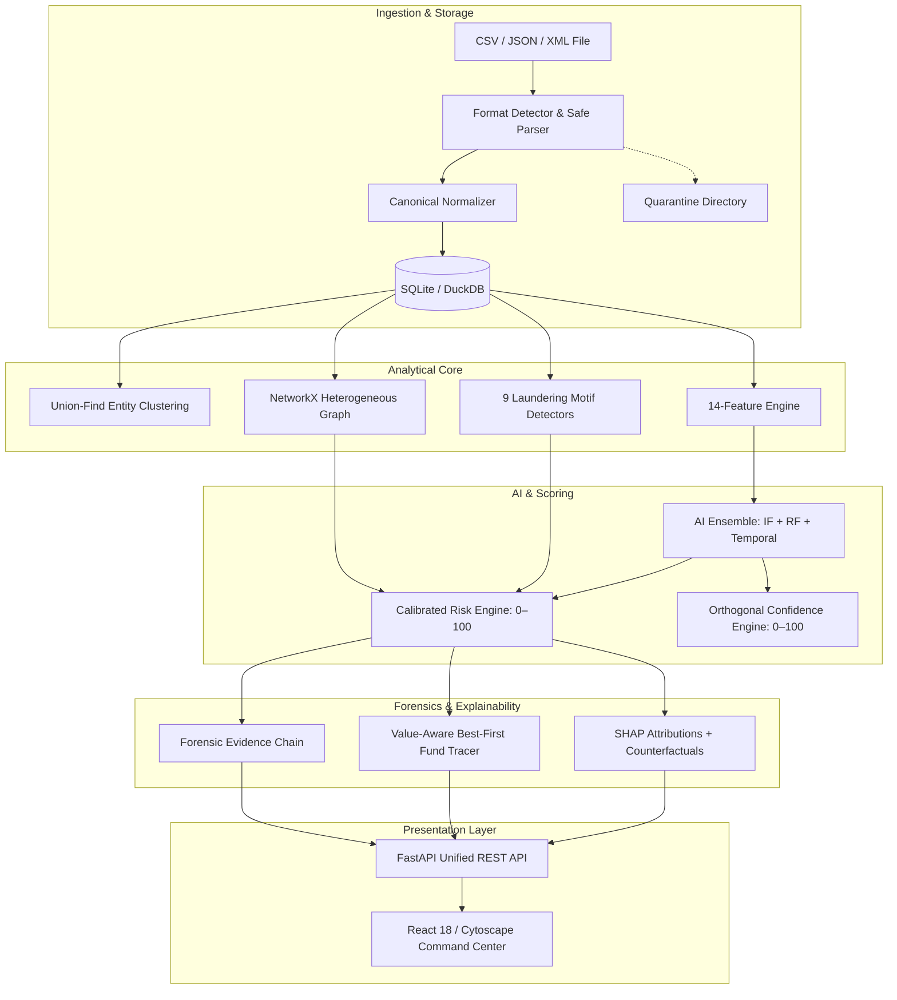

# NEXUS-BTC

> **Network–Entity eXplainable Unified Surveillance for Bitcoin**  


NEXUS-BTC is an **offline-first, air-gapped digital-forensics and Bitcoin transaction traffic monitoring platform**. It unifies network traffic correlation, on-chain entity clustering, graph intelligence, money laundering motif detection, machine-learning ensembles, and multimodal explainability into a single cohesive, production-grade application.

---

## Key Capabilities & Non-Negotiable Features

1. **Air-Gapped Offline Operation:** 100% operational without internet connectivity. Zero CDNs, zero Google Fonts, zero mandatory cloud services or paid APIs.
2. **Multi-Format Ingestion Engine:** Automated detection and parsing of CSV, JSON, and XML with safe XXE defense and quarantine isolation for corrupt rows.
3. **Temporal Network–Blockchain Correlation:** Correlates broadcast IPs, ASNs, and countries with on-chain TXIDs under rigorous forensic disclaimers.
4. **Entity Clustering Heuristics:** Optimal Union-Find Disjoint Set Union (Common-Input) and density-based HDBSCAN behavioral clustering.
5. **Heterogeneous Graph Intelligence:** In-memory NetworkX MultiDiGraph modeling IPs, Wallets, Entities, Transactions, ASNs, and Countries; serializable to Cytoscape.js.
6. **9 Laundering Motif Detectors:** Peeling Chains, Mixing/CoinJoin, Fan-In, Fan-Out, Rapid Layering, Circular Flow, Dormant Activation, Suspicious Consolidation, and Rapid Split.
7. **Multi-View AI Ensemble:** Isolation Forest (unsupervised baseline) + Platt-calibrated Random Forest (supervised classification) + Temporal Burst Z-score velocity.
8. **Orthogonal Scoring Engine:** Separate **Risk Score** ($0–100$) and **Confidence Score** ($0–100$).
9. **Multimodal Explainability:** SHAP TreeExplainer waterfall plots, counterfactual sensitivity analysis ("what-if" deltas), and graph topological ablation.
10. **Value-Aware Best-First Fund Tracing:** Priority queue forward tracing with semantic endpoint classification (`SERVICE`, `DORMANT`, `MIXER_LIKE`, `HORIZON`, `CYCLE`).
11. **Ranked Alert Queue & Evidence Chain:** Prioritized alerts with clickable 6-stage chronological forensic evidence chains.
12. **Tactical Command Center Dashboard:** Dark analytical command center with 10 interactive views, Cytoscape network graphs, and zero external asset dependencies.
13. **12 Synthetic Adversarial Topologies:** Built-in scenario generator for benchmark evaluations with hidden ground truth labels.

---

## Architectural Principles

```
  ONE APPLICATION   |   ONE CANONICAL SCHEMA   |   ONE DATABASE
  ONE GRAPH MODEL   |   ONE UNIFIED API        |   ONE FRONTEND
```

Unlike disparate multi-repository collections, NEXUS-BTC operates as a single application without duplicated models, redundant dependencies, or GPL license contagion.



---

## 5-Minute Quickstart

### Prerequisites
- Python 3.11, 3.12, 3.13, or 3.14
- Linux, macOS, or Windows (WSL2)

### Installation & Run

```bash
# 1. Clone or navigate to the repository
cd nexus-btc

# 2. Set up virtual environment
python3 -m venv .venv
source .venv/bin/activate  # On Windows: .venv\Scripts\activate

# 3. Install backend dependencies
pip install --upgrade pip
pip install -r backend/requirements.txt

# 4. Ingest sample forensic dataset
python -m nexus ingest data/sample/transactions_sample.csv

# 5. Launch the offline server (serves both API and pre-built frontend)
python -m nexus serve --host 127.0.0.1 --port 8000
```

Open your browser to: **[http://127.0.0.1:8000](http://127.0.0.1:8000)**

---

## Development Setup

### Running Backend & Frontend Concurrently

If modifying the React frontend:

```bash
# Terminal 1: Backend
source .venv/bin/activate
python -m nexus serve --host 127.0.0.1 --port 8000

# Terminal 2: Frontend Vite Dev Server
cd frontend
npm install
npm run dev
```

Frontend dev server runs at `http://localhost:5173` with automatic proxying to backend on port 8000.

### Compiling Production Frontend Bundle
```bash
cd frontend
npm run build
```
Compiled assets are output to `frontend/dist/` and automatically served by FastAPI when running `python -m nexus serve`.

---

## Air-Gapped Verification Script (`scripts/offline_test.sh`)

Validate that the platform complies with all 10 non-negotiable offline requirements:

```bash
bash scripts/offline_test.sh
```

This automated runner:
1. Simulates physical air-gap isolation.
2. Launches the local backend.
3. Audits the frontend bundle for prohibited CDN/remote fonts.
4. Ingests sample data via API.
5. Executes the AI pipeline.
6. Validates the alert queue and scoring orthogonality.
7. Queries the graph endpoint.
8. Executes value-aware fund tracing.
9. Retrieves SHAP explanations and counterfactuals.
10. Validates model evaluation metrics.

---

---

## CLI & Linux Terminal Console Reference

NEXUS-BTC provides both a direct CLI utility and an **interactive Linux terminal console (`nexus-console`)** styled after **Metasploit Framework (`msfconsole`)** and **Zphisher** menu workflows:

### 1. Interactive Metasploit-Style Console (`msfconsole`)
Launch the modular forensic console shell with tab-completion, dynamic ASCII banners, and module context switching:

```bash
# Launch interactive Metasploit console
./nexus-console
# or: python -m nexus console
```

Inside the console:
```text
nexus-btc > show alerts
nexus-btc > show motifs
nexus-btc > show scenarios
nexus-btc > use tracing/best_first
nexus-btc (best_first) > show options
nexus-btc (best_first) > set TARGET 7489170ee5b19babac1fc78a3d439a50079768ca8a0a3f97cd40493ab3af145e
nexus-btc (best_first) > set HOPS 4
nexus-btc (best_first) > run
nexus-btc (best_first) > back
nexus-btc > explain ALT-7489170E
nexus-btc > exit
```

### 2. Interactive Zphisher-Style Menu Wizard
Launch the numbered operator wizard:

```bash
# Launch Zphisher-style numbered wizard
./nexus-console --menu
# or: python -m nexus menu
```

Select operations `[01]` through `[12]` (e.g. `[01]` Run Pipeline, `[02]` Fund Tracer, `[03]` Deep Investigation, `[04]` Alert Queue, `[06]` SHAP Studio, `[07]` Adversarial Scenarios, `[11]` Web Server, `[00]` Exit).

### 3. Direct Command-Line Invocations
```bash
# Fund Tracer (ASCII traversal path)
./nexus-console trace 7489170ee5b19babac1fc78a3d439a50079768ca8a0a3f97cd40493ab3af145e 4 txid

# Deep Transaction & Telemetry Investigation
./nexus-console investigate 7489170ee5b19babac1fc78a3d439a50079768ca8a0a3f97cd40493ab3af145e

# SHAP Attribution Waterfall & Counterfactuals
./nexus-console explain ALT-7489170E

# Generate & Ingest Synthetic Adversarial Scenario
./nexus-console scenario MIXING_LIKE 15 42

# Execute master 14-stage forensic pipeline
./nexus-console pipeline

# Ingest data (CSV / JSON / XML / sample)
./nexus-console ingest sample
./nexus-console ingest data/sample/transactions_sample.json

# Check offline diagnostics and database status
./nexus-console status

# Launch offline web server
./nexus-console serve --port 8000
```


---

## API Reference

All API endpoints operate locally without external authentication requirements:

| Method | Endpoint | Description |
| :--- | :--- | :--- |
| `GET` | `/api/health` | System health, database status, and offline mode flag. |
| `POST` | `/api/ingest` | Multi-format file ingestion (CSV, JSON, XML). |
| `GET` | `/api/alerts` | Prioritized alert queue with risk/confidence filters. |
| `GET` | `/api/alerts/{id}` | Detailed alert dossier, evidence chain, and explanations. |
| `GET` | `/api/entities/{id}`| Entity profile, member wallets, and aggregate metrics. |
| `GET` | `/api/transactions/{txid}` | Canonical transaction record and network correlation. |
| `GET` | `/api/graph` | Cytoscape-formatted heterogeneous graph elements. |
| `POST` | `/api/trace` | Best-first value-aware fund tracer. |
| `GET` | `/api/explanations/{id}` | SHAP attributions, counterfactuals, and graph ablations. |
| `POST` | `/api/scenarios/generate`| Generate synthetic adversarial laundering topologies. |
| `GET` | `/api/model/metrics` | Precision, Recall, F1, PR-AUC, and Confusion Matrix. |

Interactive API documentation (Swagger UI) is available locally at `/api/docs`.

---

## Forensic Caveats & Ethical Considerations

1. **Relay Observation Disclaimer:** IP addresses recorded in transaction observations represent network relay nodes or P2P broadcast endpoints, not legal identities of wallet holders.
2. **Probabilistic Entity Inference:** Address groupings generated by Common-Input clustering and HDBSCAN represent *probable behavioral clusters*, not confirmed legal individuals or corporate entities.
3. **No Fabricated Data:** All metric reports, ROC-AUC, F1, and PR-AUC scores reflect real measured evaluations against synthetic ground truths or local offline datasets.

---

## Provenance & License

NEXUS-BTC is released under the **MIT License**. See [LICENSE](LICENSE) for details.

For clean-room provenance and licensing audits of inspected reference repositories (Cryptracer, Elliptic, Bitcoin_Fraud_Gnn, ElliptiGraph, SIH26146), see [THIRD_PARTY_NOTICES.md](THIRD_PARTY_NOTICES.md).
