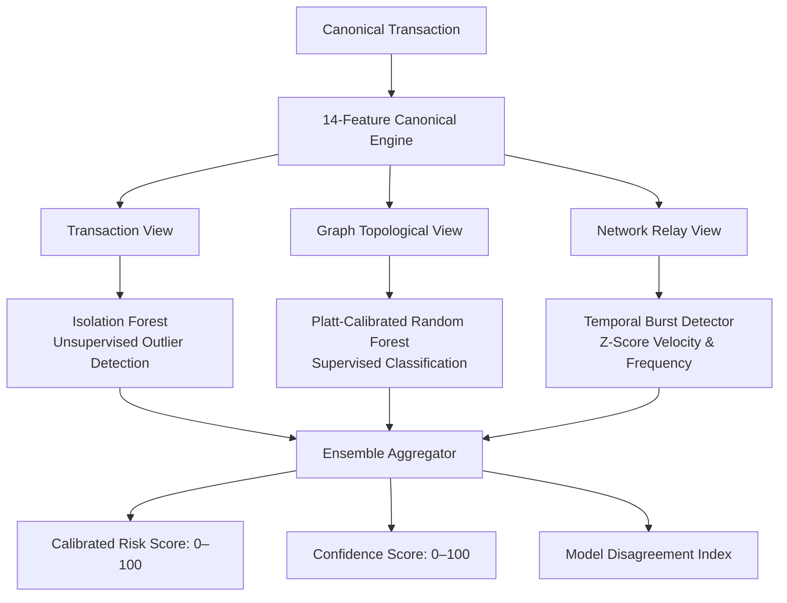

# NEXUS-BTC: AI Detection & Machine Learning Architecture

NEXUS-BTC implements a multi-view model ensemble designed for offline, interpretable Bitcoin transaction surveillance. Rather than relying on black-box predictions, the AI engine evaluates transactions across transaction, topological graph, and network relay views, preserving model disagreement and reporting independent probabilities.

---

## 1. Multi-View Ensemble Architecture

The ensemble combines three independent statistical and machine-learning models:

### 1.1 Model 1: Isolation Forest (Unsupervised Baseline)
- **Objective:** Detects structural and numerical anomalies without requiring pre-labeled training data.
- **Features Evaluated:** Velocity, fee ratio, fan-out ratio, output entropy, value preservation.
- **Normalization:** Raw decision function scores normalized to $[0.0, 1.0]$.

### 1.2 Model 2: Platt-Calibrated Random Forest (Supervised Classification)
- **Objective:** Classifies known illicit transaction patterns (layering, mixers, high-risk peel chains).
- **Calibration:** Utilizes sigmoid/Platt calibration (`CalibratedClassifierCV`) so predicted probabilities represent true empirical risk frequencies.
- **Disagreement Handling:** Preserved independently in alert metadata (`model_contributions.random_forest`).

### 1.3 Model 3: Temporal Burst Detector
- **Objective:** Flags rapid multi-hop layering and flash transactions.
- **Mechanics:** Computes rolling Z-scores on inter-transaction arrival deltas and volume velocity.

---

## 2. Canonical 14-Feature Vector

Every transaction is mapped to a standardized 14-dimensional feature vector:

| Index | Feature Name | View | Description | Normalization |
| :---: | :--- | :--- | :--- | :--- |
| 0 | `volume_btc` | Transaction | Output amount in Bitcoin | $\log_{10}(1 + v)$ |
| 1 | `fee_ratio` | Transaction | Fee divided by total input volume | Clipped $[0.0, 1.0]$ |
| 2 | `input_count` | Transaction | Number of inputs | $\min(n / 20, 1.0)$ |
| 3 | `output_count` | Transaction | Number of outputs | $\min(n / 20, 1.0)$ |
| 4 | `io_ratio` | Transaction | Outputs divided by inputs | Ratio normalized |
| 5 | `velocity_s` | Transaction | Time delta since parent transaction (seconds) | $\log_{10}(1 + \Delta t)$ |
| 6 | `holding_time_hours` | Transaction | Estimated UTXO dormancy period | Scaled $[0.0, 1.0]$ |
| 7 | `counterparty_diversity`| Transaction | Unique counterparty ratio | Entropy $[0.0, 1.0]$ |
| 8 | `address_reuse_count`| Transaction | Count of repeated input/output addresses | $\min(c / 5, 1.0)$ |
| 9 | `graph_degree` | Graph | Total degree in transaction subgraph | $\min(d / 50, 1.0)$ |
| 10 | `fan_out_ratio` | Graph | Ratio of outgoing edges to incoming edges | Ratio normalized |
| 11 | `pagerank_score` | Graph | NetworkX PageRank centrality score | Scaled $[0.0, 1.0]$ |
| 12 | `ip_tx_frequency` | Network | Transactions observed per source IP | Scaled frequency |
| 13 | `asn_diversity` | Network | Unique ASNs associated with entity | Count normalized |

---

## 3. Risk vs. Confidence Orthogonality

A core architectural principle of NEXUS-BTC is that **Risk is NOT Confidence**:

- **Risk Score ($0–100$):** Measures the estimated probability and severity of illicit behavior (laundering motifs, structural anomalies, and ML scores).
- **Confidence Score ($0–100$):** Measures the **epistemic quality** of the investigation:
  - Data completeness (input/output hashes present, network observations recorded).
  - Graph evidence depth (number of connected hops and edges).
  - Ensemble agreement (low variance between Isolation Forest and Random Forest).
  - Observation stability.

| Scenario | Risk Score | Confidence Score | Forensic Interpretation |
| :--- | :---: | :---: | :--- |
| **Well-documented Peeling Chain** | **88 / 100** | **94 / 100** | High risk, high evidentiary certainty. Immediate investigation warranted. |
| **Obscure Single-Hop Anomaly** | **85 / 100** | **35 / 100** | High risk, but low confidence due to limited graph depth. Requires further data collection before escalation. |
| **Standard Exchange Withdrawal** | **12 / 100** | **96 / 100** | Benign routine activity with high confidence. Safe to filter out. |

---

## 4. Model Versioning & Reproducibility

Every trained model artifact stored in `models/` includes a cryptographic metadata envelope:
- `model_version`: Semantic version identifier.
- `training_dataset`: Canonical dataset name and row count.
- `feature_schema`: List of ordered feature names.
- `hyperparameters`: Full dictionary of model parameters.
- `random_seed`: Seed used for deterministic reproduction (default: 42).
- `metrics`: Precision, Recall, F1, PR-AUC, and ROC-AUC measured against ground truth.
- `training_timestamp`: UTC timestamp of training completion.
